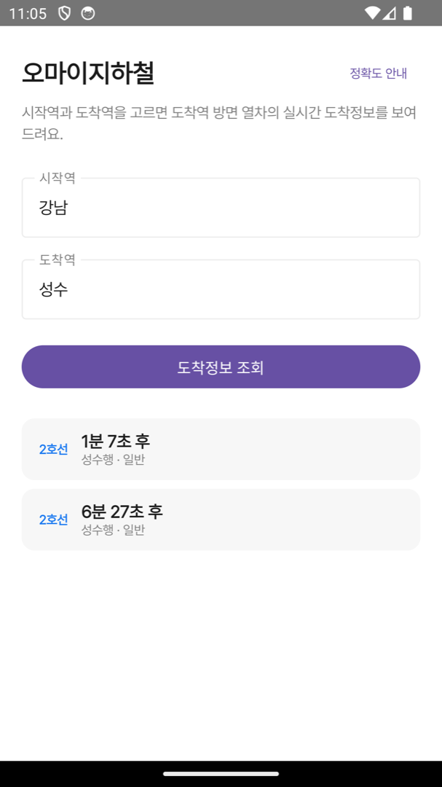
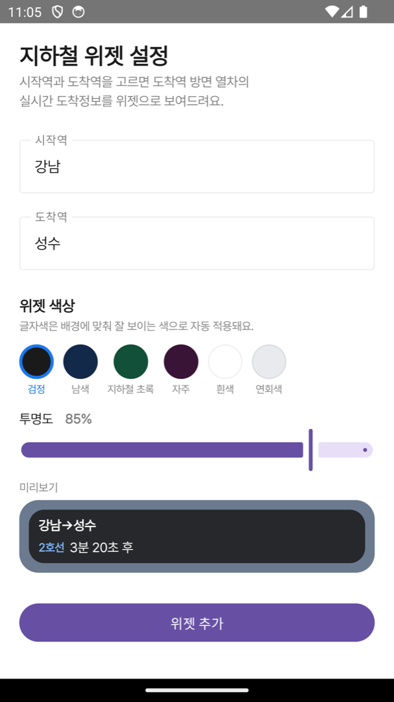
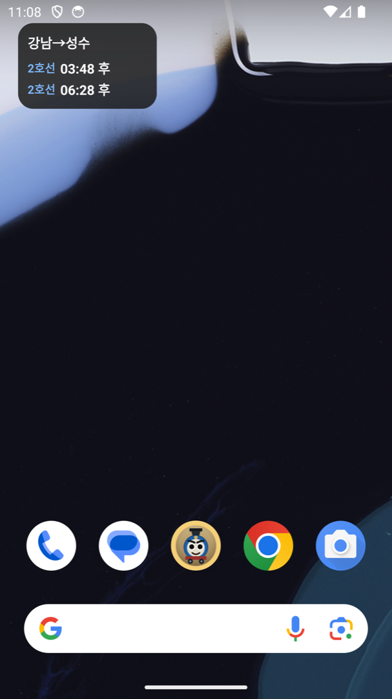
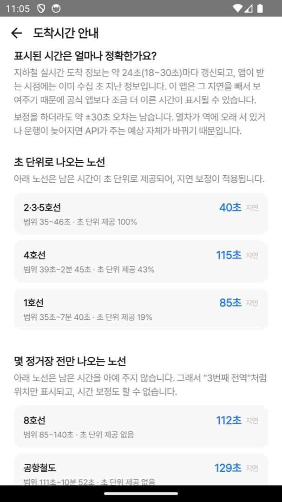

# 오마이지하철 (OhMySubway)

시작역과 도착역을 고르면 **그 방향으로 가는 열차만** 골라서 실시간 도착정보를 보여주는 Android 앱.
홈 화면 위젯으로 앱을 열지 않고도 확인할 수 있다.

서울 열린데이터광장의 [실시간 지하철 도착정보 API](https://data.seoul.go.kr/dataList/OA-12764/A/1/datasetView.do)를 사용한다.

---

## 화면

| 도착정보 조회 | 위젯 설정 | 홈 화면 위젯 | 정확도 안내 |
|:---:|:---:|:---:|:---:|
|  |  |  |  |

---

## 핵심 기능

### 방향을 알아서 골라준다

지하철 API는 한 역의 상행·하행 열차를 전부 내려준다. 강남역에서 성수 방면으로 가고 싶은데
반대 방향 열차까지 같이 보이면 매번 눈으로 걸러야 한다.

이 앱은 **시작역과 도착역 두 개만 고르면** 노선도상 두 역의 인덱스를 비교해 방향 부호를 정하고,
그 방향 열차만 남긴다. 환승 없이 한 노선으로 이어지는 구간을 지원한다.

판별에는 두 가지 단서를 순서대로 쓴다. 먼저 `trainLineName`에서 뽑은 다음 정차역(`"성수행 - 구의방면"` → `구의`)의
방향 부호를 보고, 노선도에 없으면 종착역으로 판별한다. 급행이 역을 건너뛰어도 방향 부호는 유지되므로
다음 정차역 쪽이 더 안정적이다. 2호선 같은 순환선은 두 역 사이의 짧은 호 방향을 택한다.

### 데이터 지연을 보정한 도착시간

API는 약 24초 주기의 스냅샷을 주고, 앱이 받는 시점에는 이미 수십 초 묵은 정보다.
그대로 보여주면 실제보다 늦은 시간이 표시된다.

그래서 응답에 담긴 생성 시각(`receivedAtMillis`)과 현재 시각의 차이만큼을 빼서 표시한다.

```kotlin
val stalenessSeconds = ((nowMillis - receivedAtMillis) / 1000).coerceAtLeast(0)
return (secondsToArrival - stalenessSeconds).coerceAtLeast(0).toInt()
```

보정을 하더라도 ±30초 오차는 남는다. 앱 안의 **정확도 안내** 화면에 노선별 실측 지연값과
측정 조건(2026-08-12 18~19시, 역 8곳 98건)을 그대로 적어두었다.
초 단위 정보를 아예 주지 않는 노선(8호선·공항철도 등)은 보정 없이 API 문구를 그대로 보여준다.

### 홈 화면 위젯

Glance로 만든 위젯. 배터리를 아끼려고 **자동 갱신은 하지 않고 눌렀을 때만 조회**하며,
누른 뒤 30초 안에 다시 누르면 같은 데이터라 조회를 건너뛴다.
표시된 숫자는 홈 화면을 보고 있는 동안 위젯 자체적으로 카운트다운된다.

배경색 6종과 투명도를 고를 수 있고, 글자색은 배경 밝기에 맞춰 자동으로 결정된다.
설정 화면에서 실제 위젯이 어떻게 보이는지 미리보기로 확인할 수 있다.

---

## 기술 스택

- **Kotlin** 2.1.0 / **Compose** (BOM 2025.08.00) / **Material 3**
- **Glance** 1.1.1 — 앱 위젯
- **Hilt** 2.52 + KSP — DI
- **Retrofit** 3.0.0 + **OkHttp** 5.2.1 + kotlinx.serialization — 네트워크
- **DataStore** — 위젯 상태 저장 (Glance `PreferencesGlanceStateDefinition`)
- **MVI** — `MVIViewModel<Intent, State, Effect>` 기반 단방향 상태 관리
- minSdk 26 · targetSdk 35 · AGP 8.7.2

## 모듈 구조

```
app                    앱 진입점, 네비게이션, DI 조립
├── core               MVI 계약 (Container, MVIViewModel), 공통 base
├── domain             모델 · UseCase · Repository 인터페이스 (순수 Kotlin)
├── data               Retrofit 구현체, API 응답 매핑
├── design:compose     테마 · 타이포 · 색상
└── presentation
    ├── common         역 검색 필드 등 공용 컴포넌트
    ├── home           도착정보 조회 화면
    ├── widget         위젯 + 위젯 설정 화면
    └── guide          정확도 안내 화면
```

빌드 설정은 `build-logic`의 convention 플러그인으로 공통화되어 있다.

## 빌드

서울 열린데이터광장에서 [실시간 지하철 도착정보 인증키](https://data.seoul.go.kr/)를 발급받아
프로젝트 루트의 `local.properties`에 추가한다.

```properties
SEOUL_SUBWAY_API_KEY=발급받은_인증키
```

키가 없으면 `sample` 값으로 빌드되며, 샘플 키는 조회 건수가 제한된다.

```bash
./gradlew :app:installDebug
```
